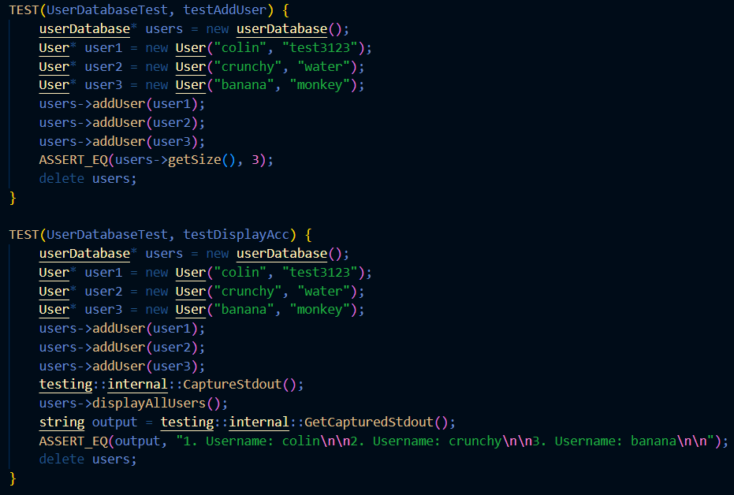

# Library Management System Project
 
# Authors
Jorge Perez(https://github.com/foreign-cobra), 
Colin Truong(https://github.com/colintruong), 
Alexander Chavez(https://github.com/AlexC111013), 
Matthew Budding(https://github.com/MatthewBudding)

## Project Description
This LMS project is especially interesting to all four group members as it has a fairly straightforward design philosophy with enough complexity to test our knowledge of important C++ concepts, algorithms, and data structures. This project will use C++ as its main programming language, as well as common data structures in object-oriented programming such as hashtables, the list data structure, and input/output writing/reading functionalities. 

This program will be focused on user interaction, so the main input the program receives will be the user's demands. These demands include, but are not limited to:
- Signing up for an account to use the LMS
- "Borrowing" a book registered within the LMS
- Entering records of new books for future users to borrow
- "Returning" a borrowed book
- The ability to "look up" a book within the LMS database to borrow
- Settling fines for overdue books
- Retrieving details of a specified book of their choosing. This includes the book's author, genre, summary, etc...
- Reading an extensive summary of the book they desire

While many of the LMS' features are already listed above, they are explained in a bit more detail here. 

- A hash function will be used to generate a unique ID for the books within the database. Users will be able to "look up" a specified book using the book title. 

- A list data structure will be used to generate a "reading list" for every user with an account. There will be a limit to how many books a user can borrow. Each "reading list" will be tied to a different account. 

- Books are exclusive. Books that are borrowed by one user will not be available to others. 

- New books added to the LMS by a user will be added to the hashtable. An ID will be generated for it, but users will have to input their own information for the book specifications. This information is the book's title. 

- A list of users will be stored in a user database. They will have access to book borrowing, returning, settling fines, and of course, 
reading an extensive summary of the book they borrowed. 

- There is an exclusive admin username and password. The admin will be able to ouput a list of every current user, and be able to add 
new books to the database as well. No other users will have access to these features. 

- As always, input validation will be implemented in any and all inputs.

 
## User Interface Specification

### Navigation Diagram

This navigation diagram shows the entire map of navigation through the program and how we are able to get to a certain screen. Using this map, the reader can understand many of the features of the library system.

> 

### Screen Layouts

Starting at the signup/login screen, the user is prompted to input a username and password to create an account. From there, the user is sent to the main menu, where the user has several actions to choose from. They can either look at their user profile, search for a book, or exit the program.

First, we'll talk about searching for a book. The user can either enter the title of the book (if it's in the database) or add a new book to the database. Searching for a book that's in the database requires that it is exactly the same as the title of the book as it will be case-sensitive. Once the user finds their book, the book page will display. It will give the user the option to borrow the book if it is available. If the user is already borrowing the book, the option to return or read the book will be unlocked. If it's unavailable, the user cannot do any of the three actions. This all depends on the status of the book for the user.

Next, traversing back to the main menu, we go to the user profile. From the user profile, you can check your account info, borrowed books, or book fines. Going to your account info will show you your current username and password and give you the option to change your username or password if you'd like. Doing so will automatically sign you out of the library management system and make you sign up with your changed credentials. The borrowed books page allows you to check what books you are currently borrowing, listed in alphabetical order. You may enter the number that corresponds with the book to visit that book page. Finally, the book fines page lists any fines you have from overdue books. It leads you to a page where you enter your payment information to pay off the fines.

> 
> 

## Class Diagram
 > This UML Diagram covers the general format of our project, there will be 3 main classes: books, the library system, and the user. The book will store information regarding itself, specfically the author, its name, the id we store it by, and so on. The library will be the users way of accessing the books, so it will contain activites that allow the user to change the books status of whether it was borrowed or not, and to create and add new books to the system. The user will store the books that they have borrowed and be able to access them for information.
 

SOLID PRINCIPLES USED:

Date and Book being separate classes showcase the use of Single Responsibility Principle. Book should handle all the responsibility of holding the information about the book and displaying it. Date should create the format of how the date is being held and formatted managing everything to do with the creation of the date a book was borrowed to checking the current date. 

Book and User having no direct connection showcases interface segregation principle. The User has to go through the library to access their books, they don’t have direct access to the book class because its the library that needs to work with the books. The books also shouldn’t have access to anything about the user because the user doesn’t matter to the book, nothing it does has any relation to the user.

The library class having an add new book feature is an example of the Open/Closed Principle, as you can add to the number of books within the database, but you cannot edit the books that already exist within it. It was applied by creating the addNewBook function as this allows us to add to the existing library, but we cannot edit what currently exists in it. This change helps our code by ensuring what exists is kept clean, but still allows additional features to be implemented.

 
 
POST PHASE 3 UML DIAGRAM UPDATE:

Seperated the display functions into their own class as suggested in Milestone 3

 ## Screenshots

Our application requires constant input from the user. It has a "back-and-forth" exchange in order for the program to run smoothly. 
Here are a couple screenshots of the various actions a user can do while running the program.

Creating an Account / Signing In

Options displayed after selecting "User Profile"

Outputting a user's list of borrowed books

Searching for a book successfully

Searching/Returning a book unsuccessfully

Displaying the list of users as an admin

Adding a book as an admin

Terminating the program

 ## Installation/Usage

This application is fairly easy to use as it is compatible with many up-to-date operating systems. First, you must hop onto VS Code and 
run the command this command to clone the repository.

 * git clone --recursive https://github.com/cs100/final-project-mbudd003-achav239-ctruo045-jpere470.git

After you have done so, run the following commands to generate the executables and appropriate MakeFile.

 * cmake .
 * make

Before you run any executables, please drag the "database.txt" and "accounts.txt" files in the repository to the "bin" folder that was 
just created if they are not already there. This is necessary as the files won't be read if you run the executable while they are not in 
the "bin" folder. Once you have dragged both text files to the folder, navigate to the bin folder and run the executable for the program
by typing in the following commands. 

 * cd bin
 * ./runProgram

Alternatively, you can run the program by using the following command.

* ./bin/runProgram

But that will cause the program to run incorrectly, as the files will not be read. 

WARNING: Any alteration of the database and account text files will inevitably result in program bugs and cause the application to not 
run correctly. If you must make changes to these files, consider doing so as an admin through actual use of the application. The information
to log in as an admin is displayed below. 

* Username: Admin1
* Password: cs100

To use the application, you must interact with it by typing a number on the keypad of your keyboard and pressing the Enter key to confirm your action. If you change your mind, you may use your backspace key to delete any unwanted key presses. The roman numerals detailed on the 
sides of the options on the application indicate which key you need to press for which action. Be advised, entering a string of characters
and then pressing enter will result in the application outputting many screens at once, which may harm your user experience. 

In some cases, you are required to enter a string of characters, including when you wish to search for a book, or adding a book to the 
database (this requires admin privileges). 

Please refer to the "Screenshots" section above this one to get a good grasp of how the application operates and to understand the layout of
the screens. 

 ## Testing

Our program heavily relied on unit testing to make this application work correctly. We have an extensive test.cpp file which includes
tests for every function in the application that can be tested reliably. Other functions that were used to output to the screen were tested 
rigorously through trial-and-error. For the CS 100 demo, we attached screenshots of the test.cpp file below. 

 
